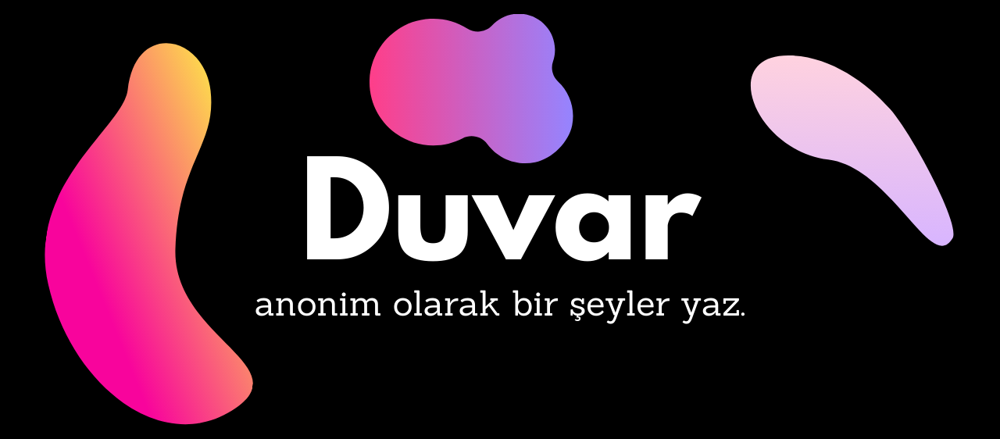

# duvar-app

Duvarov kişilerin kendilerine anonim bir duvar yaratabileceği bir uygulamadır. 

## Demo
[Duvarov Websitesi](https://duvarov.herokuapp.com/)

## Installation

`wsgi.py` dosyası çalıştırılarak direkt `127.0.0.1:5000` adresinden erişim sağlanabilir. 

Repo heroku deployment için tamamen hazırdır, `Procfile` ve `runtime.txt` dosyaları değiştirilerek versiyon değişikliği yapılabilir.

Duvar temizliği için heroku içerisinde yerel değişkeniniz `password`'un ayarlanması gerekmektedir.

## Requirements:
- flask
- sqlite3
- gunicorn